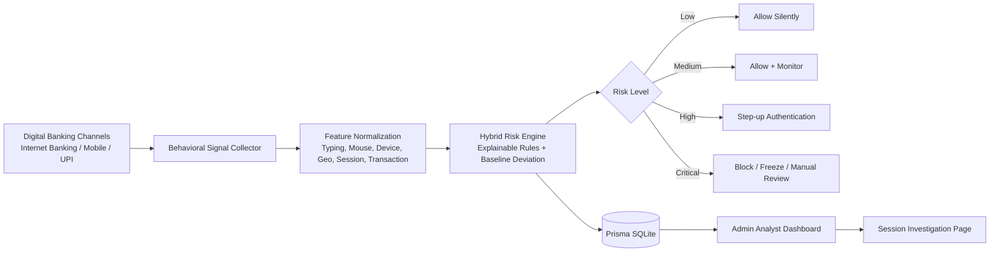

# TrustGuard AI — AI-Driven Behavioral Authentication for Digital Banking

## Project overview

TrustGuard AI is a complete hackathon MVP for a bank-grade **Behavioral Risk Intelligence Layer**. It simulates digital banking login and transaction journeys, silently collects behavioral signals, computes an explainable 0–100 risk score, and triggers adaptive authentication only when risk is meaningful.

> **Prototype disclaimer:** This is a hackathon prototype using simulated behavioral signals and explainable risk scoring. It does not process real banking credentials or real financial transactions.

## Problem statement

Passwords and OTPs are reactive controls and are often compromised through phishing, malware, SIM-swap, social engineering, or account takeover tooling. India’s digital payment ecosystem needs risk-based authentication that strengthens security while keeping legitimate customer journeys low-friction.

TrustGuard AI positions itself for the RBI 2025 digital payment authentication direction where issuers may apply additional risk-based checks beyond standard authentication depending on fraud risk. This project does **not** claim official RBI integration.

## Solution

TrustGuard AI demonstrates continuous behavioral authentication across:

- Internet Banking
- Mobile Banking
- UPI platforms
- Cardless ATM / open banking style channels
- Other digital banking channels

The system collects or simulates:

- Typing cadence: dwell time, flight time, typing speed, backspace frequency
- Mouse behavior: movement speed, hesitation, click precision, path irregularity
- Device fingerprint simulation: browser, OS, screen size, timezone, language
- Geo/IP simulation: usual city vs unusual city
- Session behavior: login time, failed attempts, session duration
- Transaction behavior: amount deviation, new beneficiary, unusual channel
- Mobile simulation: touch pressure, swipe velocity, device rotation placeholders

## Tech stack

- **Frontend:** Next.js 14 App Router, TypeScript, Tailwind CSS
- **UI:** shadcn-style local components, lucide-react icons, Recharts charts
- **Backend/API:** Next.js API routes
- **Database:** Prisma with SQLite
- **ML/risk layer:** JS-based hybrid explainable scoring engine
- **Deployment:** Vercel-compatible frontend and API routes

## Architecture



## Explainable risk engine

The scoring pipeline is transparent and judge-friendly. Every feature is normalized to `0..1`, multiplied by a visible weight, and summed into a 0–100 score.

```txt
riskScore =
  deviceRisk * 15 +
  locationRisk * 15 +
  typingAnomaly * 15 +
  mouseAnomaly * 10 +
  failedAttemptsRisk * 10 +
  transactionAmountRisk * 15 +
  newBeneficiaryRisk * 10 +
  channelRisk * 5 +
  timeAnomalyRisk * 5
```

Additional impossible-travel simulation can add risk pressure for critical demos.

### Thresholds

- `0–30`: Low → allow silently
- `31–60`: Medium → allow + monitor
- `61–80`: High → step-up authentication
- `81–100`: Critical → block / freeze / manual review

### Hybrid ML approach

For hackathon reliability, TrustGuard AI uses:

1. Rule-based explainable risk score
2. Statistical baseline deviation from stored user behavior
3. Stored session, transaction, and risk-event history
4. A clear path to production ML such as Isolation Forest, sequence models, federated learning, and real-time model monitoring

## Pages and features

| Route | Purpose |
| --- | --- |
| `/` | Premium landing page with problem, solution, features, architecture, and CTA |
| `/login` | Simulated digital banking login with typing/mouse collection and scenario selector |
| `/banking` | Mock customer banking dashboard with balances and quick actions |
| `/transfer` | Simulated transfer form with pre-execution risk scoring |
| `/step-up` | Adaptive authentication screen with OTP, security question, and face verification placeholders |
| `/admin` | Analyst dashboard with metrics, sessions table, and Recharts visualizations |
| `/session/[id]` | Detailed investigation page with signals, risk factors, timeline, decision, and explainability |

## Demo scenarios

The scenario selector supports:

1. Normal user login from known device and location
2. Suspicious login from new device
3. High-value transfer to new beneficiary
4. Repeated failed login attempts
5. Impossible travel scenario
6. Bot-like typing pattern
7. Account takeover attempt

## Setup

```bash
npm install
cp .env.example .env
npx prisma db push
npm run seed
npm run dev
```

Open <http://localhost:3000>.

## Demo reset

```bash
npm run demo:reset
```

This force-resets the SQLite database, pushes the Prisma schema, and reloads demo seed data.

## Environment variables

| Variable | Default | Description |
| --- | --- | --- |
| `DATABASE_URL` | `file:./dev.db` | SQLite database used by Prisma |
| `NEXT_PUBLIC_APP_URL` | `http://localhost:3000` | Base URL used by server-rendered session investigation pages |

## API routes

| Method | Route | Description |
| --- | --- | --- |
| `POST` | `/api/risk/login` | Scores login/session behavioral signals |
| `POST` | `/api/risk/transaction` | Scores transaction + session risk |
| `GET` | `/api/admin/summary` | Returns dashboard metrics and chart data |
| `GET` | `/api/admin/sessions` | Returns recent sessions for analyst table |
| `GET` | `/api/admin/session/:id` | Returns detailed investigation data |

## Suggested judging pitch

- **Problem:** Static passwords and OTPs are reactive, high-friction, and frequently compromised.
- **Solution:** Continuous behavioral authentication that evaluates whether the user behaves like the legitimate customer.
- **Innovation:** Transparent AI risk scoring with adaptive authentication and top-three explanations for every decision.
- **Impact:** Reduces account takeover and payment fraud while improving UX by challenging only risky sessions.
- **Channels:** Designed for Internet Banking, Mobile Banking, UPI, and other digital banking channels.
- **Bank-grade angle:** TrustGuard AI sits on top of existing login/payment rails as a behavioral risk intelligence layer.

## Future scope

- Federated learning across bank devices without centralizing raw behavioral biometrics
- Privacy-preserving feature stores and differential privacy for behavioral telemetry
- Isolation Forest / sequence anomaly models served from a Python FastAPI ML microservice
- Integration with fraud case-management systems, SIEM, and transaction monitoring platforms
- Real-time model monitoring, drift detection, champion/challenger deployment, and human feedback loops
- FIDO/passkey and biometric provider integration for production adaptive authentication

## Limitations

- Signals are simulated or browser-derived for demo purposes only.
- No real bank login, payment rail, UPI, OTP, KYC, IP intelligence, or face-verification provider is connected.
- The explainable scoring model is intentionally simple for hackathon clarity and should be validated, monitored, and governed before production use.
- The app stores demo data in local SQLite by default.
